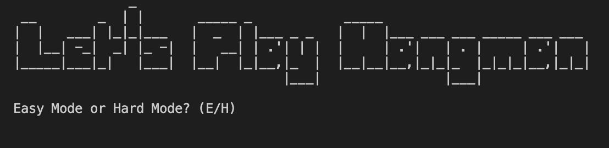
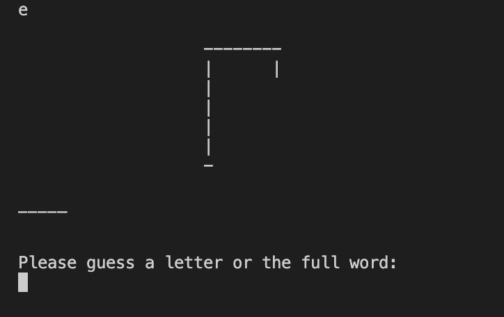
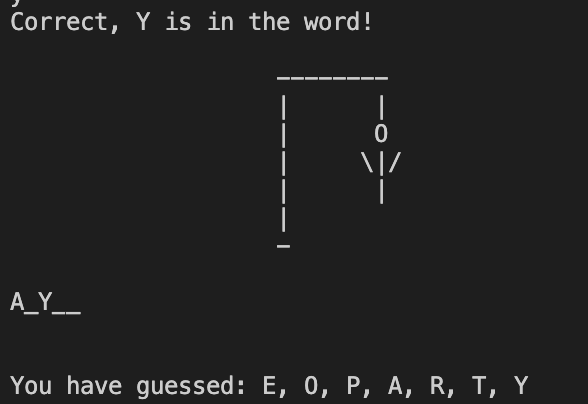
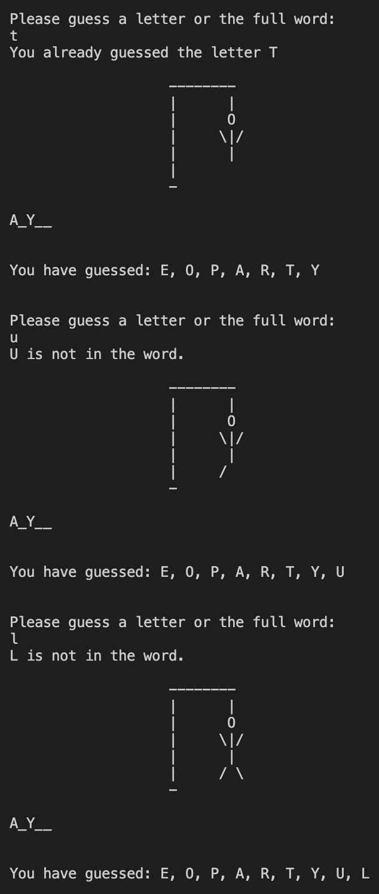
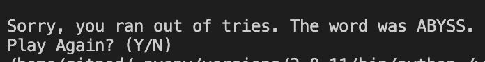
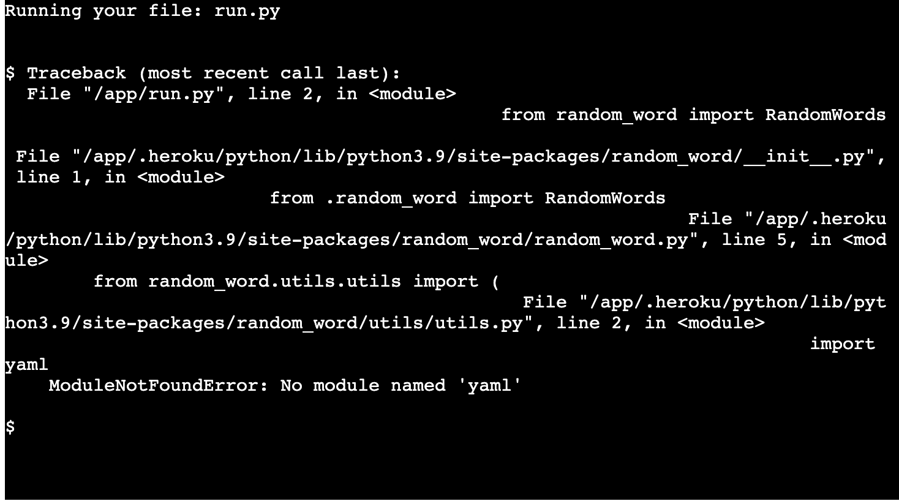
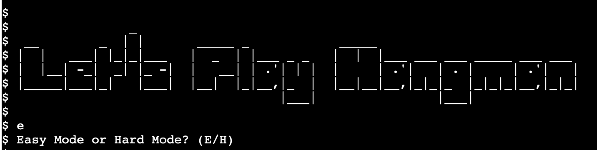

# Testing

## User Stories Tested

*numbers correspond to the relevant user story in [README.md](README.md)

1. Selection of an easy or hard word.

---

*Expected result: Player will press E or H and the corresponding difficulty will be used in game.*

2. Being able to see the played letters.


*After every guess, the list of letters is appended with the latest guess if it is new.*

3. Graphical hangman displayed 


*As displayed above, hangman states are updated with each wrong guess until the end of the game.*

4. Game restart capability.

*Expected result: player presses either Y or N and the game restarts if the input is Y.*

5. Random words are generated for the game by using the Random-Word package, except in the case of the player using an easy difficulty. In that case the word is sourced from [easy_words.py](easy_words.py) which contains a list of more common words than those generated by Random-Word. 

## Bugs

1. After deployment, the program would fail to run and would throw an error 
    ```
    ModuleNotFoundError: No module named 'yaml'
    ```

    

    This was fixed by doing some research and discovering that a module named [PyYAML](https://pypi.org/project/PyYAML/)        

2. After deployment, input requests would not appear in the mock terminal but input could still be given, only showing the request after input was given. 

    
    After consulting the Slack community i found this could be solved by adding a ``` \n ``` to the end of any input.

